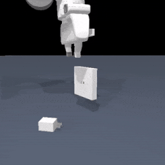
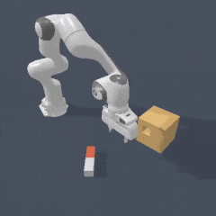
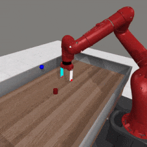
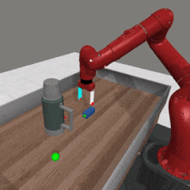
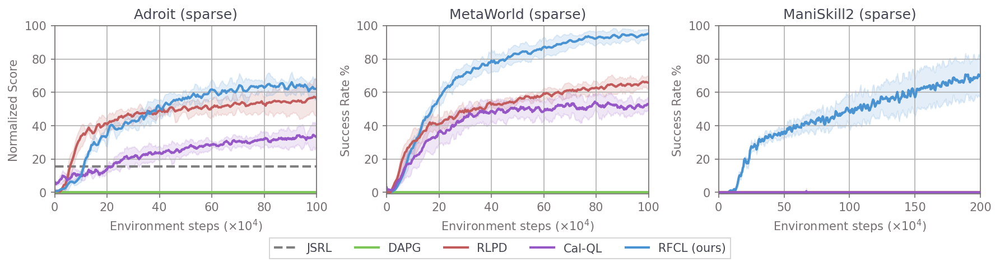

# Reverse Forward Curriculum Learning (RFCL)

<p align="center">
  
  
  
  
  
</p>



Reverse Forward Curriculum Learning (RFCL) is a novel approach to learning from demonstrations that enables extreme **demonstration and sample efficiency** in model-free RL. RFCL is capable of solving a wide range of complex tasks from just 1-10 demonstrations, far more demonstration efficient than prior model-free baselines. We use a per-demonstration reverse curriculum to train an initial policy capable of perform well from the initial states of the given demonstrations, and then genrealize to a larger initial state distribution via a forward curriculum. Our shows a glimpse of the potential of how demonstration/sample efficient RL can be if one leverages the properties of simulation.

**[Project Page](https://reverseforward-cl.github.io/) | [Paper](https://openreview.net/pdf?id=w4rODxXsmM) | [Open Review](https://openreview.net/forum?id=w4rODxXsmM)**

**Table of Contents**
- [Setup](#setup)
- [Data/Demonstrations](#data--demonstrations)
- [Training](#training)
- [Tuning Tips](#tuning-tips-for-rfcl)
- [Practicality / Use Cases](#ok-cool-what-is-rfcl-practical-for)
- [Testing on New Environments](#testing-on-new-environments)

<!-- todo anon: add in real names and links. Remove openreview -->
## Setup ⚙️

We recommend using conda (or the faster mamba), and installing from source as so
```
conda create -n "rfcl" "python==3.9"
pip install --upgrade "jax[cuda12_pip]" -f https://storage.googleapis.com/jax-releases/jax_cuda_releases.html
pip install -e .
```
<!-- todo anon: add git clone this repo above -->

You may need to use `pip install --upgrade "jax[cuda11_pip]" -f https://storage.googleapis.com/jax-releases/jax_cuda_releases.html` if cuda 12 is not available.

To then install dependencies for environments, run

```
pip install gymnasium-robotics==1.2.3 mani_skill2==0.5.3 # for Adroit and ManiSkill2
```

We use the older metaworld environments running on old mujoco so we recommend doing this in a separate conda env
```
conda install -c conda-forge mesalib glew glfw patchelf
pip install "cython<3" gymnasium-robotics==1.2.3
pip install git+https://github.com/Farama-Foundation/Metaworld.git@04be337a12305e393c0caf0cbf5ec7755c7c8feb
pip install shimmy[gym-v21]
```

We further provide [docker images](./docker) for each environment suite benchmarked for ease of use and deployment with all dependencies installed.

## Data / Demonstrations 📊

<!-- https://drive.google.com/file/d/1SYNg-VoiRalUnmc8qVTq1oOln00sbNoC/view -->

We benchmark on 3 environment suites, each with their own demonstrations. We have uploaded all demonstrations with env states to [hugging face](https://huggingface.co/datasets/stonet2000/robot_demos_with_state_reset). We recommend you directly download these demonstrations to a `demos/` folder as opposed to trying to format them to include environment states as the code for that is quite complicated. Download link: https://huggingface.co/datasets/stonet2000/robot_demos_with_state_reset/blob/main/demos.zip

If you are interested in how the demonstrations are formatted, you can take a look at . We take existing demonstrations from the environment suites and format them into the flexible [ManiSkill2 demonstration format](https://haosulab.github.io/ManiSkill2/concepts/demonstrations.html#format), which is used as this format supports storing environment states out of the box which is needed by RFCL.

## Training 🧠

To train, run any one of the scripts for each environment suite under `scripts/<env_suite>` (ManiSkill2: ms2, Adroit: adroit, Metaworld: metaworld). 

An example for training RFCL on ManiSkill2 (with the wall-time efficient hyperparameters) would be

```bash
seed=10
demos=5
env="peginsertion" # can be pickcube, stackcube, peginsertion, plugcharger
XLA_PYTHON_CLIENT_PREALLOCATE=false python train.py configs/ms2/sac_ms2_${env}.yml \
    logger.exp_name="ms2/${env}/rfcl_fast_${demos}_demos_s${seed}" \
    logger.wandb=True \
    train.num_demos=${demos} \
    seed=${seed} \
    train.steps=4000000
```

And for sample-efficient hyperparameters (higher update to data ratio) you would use the _sample_efficient.yml file instead

```bash
seed=10
demos=5
env="peginsertion" # can be pickcube, stackcube, peginsertion, plugcharger
XLA_PYTHON_CLIENT_PREALLOCATE=false python train.py configs/ms2/sac_ms2_${env}_sample_efficient.yml \
    logger.exp_name="ms2/${env}/rfcl_sample_efficient_${demos}_demos_s${seed}" \
    logger.wandb=True \
    train.num_demos=${demos} \
    seed=${seed} \
    train.steps=2000000
```

These will run and save experiment logs to the `exps/<logger.exp_name>` folder, which has test evaluation videos from stage 1 and stage 2 training, tensorboard logs, and model checkpoints.

See `configs/<env_suite>` for all configurations if you want to understand the exact configurations used (e.g. SAC + Q-Ensemble configs, environment configs etc.)

To visually see how the reverse curriculum is progressing through evaluation videos, pass in the argument `train.eval_use_orig_env=False`, which will then wrap the evaluation environment with the reverse curriculum wrapper and sync with the training environment's reverse curriculum. Videos here are saved to `exps<logger.exp_name>/stage_1_videos`. By default this is `True` so evaluation/test results reported to tensorboard/wandb are always the results from evaluating on the task's original initial state distribution.

### Tuning tips for RFCL 🔧

There are a few very important hyperparameters to tune if you want better performance / something is not working.

**Things to consider if you want to be able to get any success**

- `sac.discount`: Discount factor affects all RL algorithms including RFCL. In general a discount of 0.9 to 0.99 works fine for most tasks.
- `train.reverse_step_size`: Values from 4 to 8 work fine for all benchmarked tasks, particularly because the demonstration data is slow/suboptimal. For demonstrations that are very optimal / fast, this can be tuned lower in order to reduce the gap between adjacent reverse curriculums.
- `train.demo_horizon_to_max_steps_ratio`: This controls the dynamic timelimit method employed in RFCL to accelerate the reverse curriculum stage. Higher values means the timelimit is lower. We recommend tuning this based on how much faster you think an optimal policy can solve a task compared to the demonstration. If you think a task can be solved 3x faster than the demonstrations show, then set this to `3`, as is done with ManiSkill2 tasks. Setting this value to `1` is also perfectly fine and should always work. 
- `train.data_action_scale`: This is by default null, but can be set to a float value >= 1. It controls the size of the action space relative to the magnitude of actions in the demonstrations given. If this value is e.g. `1.25`, then the maximum action the training agent can take is only 125% the max action the demonstrations took. This is not used for any experiments apart from the very difficult PlugCharger environment, but certainly should make most tasks easier.
- reward function: RFCL is designed to solve sparse reward problems (+1 on success, 0 otherwise), but can also solve tasks faster if given dense rewards. As there are Q networks trained to predict Q-values, it is recommended to normalize rewards to the range [0, 1] to avoid gradient/loss explosions.
- demonstrations: RFCL is very robust to the demonstrations given, and can solve tasks even if the demonstrations are overly long, suboptimal, multimodal etc. But if you are able to collect demonstration data and care about success rate (as measured as being in a success state at the end of a episode), we recommend collecting demonstration data that do not stop upon success, but stops after achieving "stable success." An example for a cube picking task would be demonstrating picking up the cube, then holding it for a little bit before stopping the recording.


**Things to consider if you care about sample efficiency vs wall-time**
- `sac.grad_updates_per_step`: This controls the number of gradient updates performed every `env.num_envs * sac.steps_per_env` steps are taken. In our sample-efficient hyperparameters, we set this value to 80 to obtain a update to data ratio of 10 as `env.num_envs = 8` and `sac.steps_per_env = 1`. A high update to data ratio can easily improve sample efficiency, but will drastically worsen training time in simulation. A much lower update to data ratio of e.g. 0.5 as used in our wall-time efficient hyperparameters will worsen sample efficiency but drastically improve training time in simulation. Tune this to your needs!
- `sac.num_qs`: This by default is set to 10, meaning we keep an ensemble of 10 Q networks. This is a known trick for improving sample efficiency, although in some initial experiments we find this is not necessary when using a update to data ratio of 0.5. Setting this to 2 will make the configuration be equivalent to the original SAC implementation.

We also highly recommend tracking training via tensorboard or weights and biases. The code reports a number of useful metrics to help track the progress of the reverse curriculum such as `train_stats/start_step_frac_avg` and the neat histogram that shows the distribution of the start step values `t_i` of all demos. 

## Ok cool, what is RFCL practical for?

### Fast Task Solving with Little Data and Sparse Rewards

For starters, it is the **most demonstration and sample efficient** model-free method at the moment to solve the benchmarked simulated tasks: Adroit, MetaWorld, and ManiSkill2 (MS2). It is also the first (and currently the only) method (model-free or model-based) to solve PegInsertionSide and PlugCharger, two highly randomized and highly precise tasks, from sparse rewards with 10 demonstrations or less as far as we know. See [this](https://reverseforward-cl.github.io/#task-visuals-a) for visualization of those two tasks.

In terms of sample-efficiency, [Modem (TD-MPC + demonstrations)](https://nicklashansen.github.io/modemrl/) may be the most sample-efficient as they leverage world models, although the wall-time for in-simulation training is difficult to compare as it is down to implementation and it is unfair to compare "world models + planning + high sample efficiency" vs "model-free w/ no world models or planning + lower sample efficiency" on the dimension of wall-time.

Regardless, RFCL is still the fastest method to solve the hardest tasks, which are all tasks in ManiSkill2. On a RTX 4090 with 8 parallel envs with just 5 demonstrations, Adroit Door can be solved in < 5 minutes, MS2 PickCube in < 10 minutes, MS2 PegInsertionSide in < 60 minutes, which are the fastest to date. For a table of wall-times, see this TODO.


### Distilling RL Generated Demonstrations from few Suboptimal Demonstrations

It is well known most behavior cloning type methods often have difficulty when given suboptimal, multi-modal data, which is the case with human demonstrations in the Adroit environments and the motion planned demonstrations in the ManiSkill2 demonstrations. Standard behavior cloning using all 1000 ManiSkill2 demonstrations has difficulty getting any success on PegInsertionSide and PlugCharger. However, using RFCL to learn from just 10 demonstrations, we can produce a policy capable of solving both tasks, and then generate 1000s more demonstrations from a neural network policy. In our experiments, after generating 5000 demonstrations from the policies trained via RFCL and 10 motion planned demonstrations, behavior cloning is capable of achieving ~100% success on PegInsertionSide and PlugCharger.

This could pave way for a scalable solution to generate usable demonstrations for a diverse set of environments and using behavior cloning type methods to more easily learn e.g. multi-task models, large foundation models etc. To make this easy, we provide a simple script to rollout a RFCL trained policy across multiple workers to collect many demonstrations (and report success rate for easy evaluation)

```bash
XLA_PYTHON_CLIENT_PREALLOCATE=false python scripts/collect_demos.py exps/path/to/model.jx \
    num_envs=8 num_episodes=1000
```

## Testing on New Environments 🌏 / Customization 🎨

### Adding a new Environment
To test on your own custom environments/tasks, all you need to do is create an `InitialStateWrapper` and write the code to make your environment based on environment ID. The assumption here is that the environment has state reset capabilities (which is the case for all major robotics simulations e.g. ManiSkill2, Mujoco, Isaac). Moreover, we assume access to usable (optimal or suboptimal) demonstration data. Usable here means if we set the environment to the same initial state as the demonstration and replay all actions, we can still get success most of the time. Some simulators/tasks have simulation issues where this is not possible.

To add your own environment, we recommend first to git clone this repository and edit [`rfcls/envs/make_env/make_env.py`](rfcls/envs/make_env/make_env.py) and add a branch

```python
elif is_my_env(env_id):
    # import what you need
    # define a env_factory function which creates the environment like below
    def env_factory(env_id, idx, record_video_path, env_kwargs, wrappers=[], record_episode_kwargs=dict()):
        def _init():
            env = gymnasium.make(env_id, disable_env_checker=True, **env_kwargs) # or use your own env creation method
            return wrap_env(
                env, idx=idx, record_video_path=record_video_path, wrappers=wrappers, record_episode_kwargs=record_episode_kwargs
            )
        return _init
```

The wrappers will by default be populated by wrappers that turn the modify the environment to be continuous (terminated always False, truncated True when timelimit is reached), use sparse rewards only (+1 when info['success'] is True, +0 otherwise). The wrappers and any video recording wrappers are applied via the `wrap_env` function. The code expects all environments to store the success condition of the environment in `info['success']` which is returned after calls to `env.step`. Moreover, we expect code to follow the standard [Gymnasium API](https://gymnasium.farama.org/api/env/).

After this, we need to define an `InitialStateWrapper`, which can be done as so

```python
from rfcl.envs.wrappers.curriculum import InitialStateWrapper
class YourInitialStateWrapper(InitialStateWrapper):
    def set_env_state(self, state):
        # use your env's method to set the environmnet state. This should be able to set state from states that can be retrieved from the environment
        return self.env.unwrapped.set_state(state)

    def get_env_obs(self):
        # return the current environment observation.
        return self.env.unwrapped.get_obs()
```

Once defined, simply return this wrapper class in the function [`get_initial_state_wrapper` in `rfcls/envs/make_env/make_env.py`](./rfcl/envs/make_env/make_env.py#L186). 

### Adding Demonstration Data

The code here uses the [ManiSkill2 demonstration data format](https://haosulab.github.io/ManiSkill2/concepts/demonstrations.html#format). If your demonstration data isn't in this format, the easiest way to generate it is to use the RecordEpisodeWrapper as so

```python
env = make_your_env(env_id)
env = RecordEpisodeWrapper(env, save_trajectory=True, save_video=False, trajectory_name="demos/trajectory")
for demo in your_demonstration_data
    env.reset()
    env.set_state(demo["initial_env_state"]) # add code here to set the initial state to the same one in the demonstration
    for i in range(len(demo["actions"])):
        env.step(demo["actions"][i])
env.close()
```

The RecordEpsiodeWrapper assumes upon creating your environment you expose the function `env.get_env_state` which should return the current environment state as a dictionary or a flat vector. This will save the demonstration data to `demos/trajectory.h5` and necessary metadata to `demos/trajectory.json`. 

Note that the code provided above is simplified, depending on your code setup, some parts e.g. setting the first initial state may not be as simple. For example, the original Adroit human demonstrations did not have initial environment states, so we had to reverse engineer them to figure out what they were.


### Training on New Environment and Data

To train on your new environment, simply copy the base configuration in [`configs/ms2/base_sac_ms2.yml`](configs/ms2/base_sac_ms2.yml) and modify any environment kwargs you need under `env.env_kwargs` in the yml file. These are passed to both the training and evaluation environment. Suppose your new configuration is named `myconfig.yml`, you can run training easily as so by additionally specifycing the env id and demonstration dataset path:

```bash
seed=10
demos=5
XLA_PYTHON_CLIENT_PREALLOCATE=false python train.py myconfig.yml \
    logger.exp_name="my_exp_${demos}_demos_s${seed}" \
    logger.wandb=True \
    train.num_demos=${demos} \
    seed=${seed} \
    train.steps=2000000 \
    env.env_id="my_env_id" \
    train.dataset_path="demos/trajectory.h5"
```